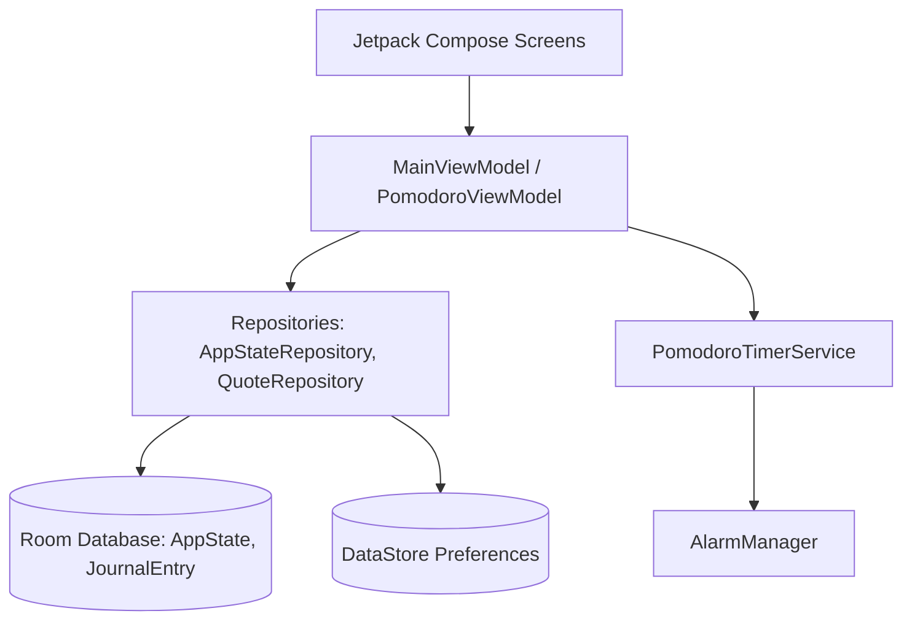

# StandBy Clock App

StandBy Clock is a feature-rich, doze-proof, and premium-designed Android application built using Jetpack Compose. It transforms your Android device into a modern, aesthetic bedside or desk standby display, offering customizable clock styles, an interactive Pomodoro timer, a Quote Board, and a scheduled Photo Journal.

---

## 📱 Features & Core Screens

### 1. Clock Screens (Screens A-D)
* **Canary Yellow**: A high-contrast, bold digital clock designed for high visibility.
* **Astronaut**: A stylized screen featuring space elements, date, time, and charging status indicators.
* **Matte Grey**: A minimalist, clean analog/digital display.
* **Structural**: A modern grid-style dashboard layout showcasing time, date, battery level, and power connection states.

### 2. Quote Board (Screen F)
* Displays custom and built-in inspirational quotes.
* **Typing Animation**: Features a custom-built, character-by-character typing animation with fade-in/fade-out transitions.
* **"Inspire Me" Function**: Pulls random quotes from a 100-quote built-in asset catalog (`quotes.json`), with safety limits on user customization (up to 500 quotes).
* **Quotes Import/Export**: Import or export custom quotes in JSON format using the Android Storage Access Framework (SAF).

### 3. Photo Journal (Screen G)
* A personalized rotation screen displaying image backdrops (or solid colors) overlaid with custom styled quotes.
* **Manual Cycling**: A "Next" button allows users to cycle to the next photo/quote combination instantly, automatically resetting rotation intervals.
* **Active Entry Editing**: Click-to-edit sheet allows direct inline modification of text, author, size, color, alignments, and fonts.
* **Crop Screen Integration**: Built-in crop editor with coordinate safety checks and bitmap recycling to prevent out-of-memory errors.

### 4. Journal Management
* View all photo-journal entries in a `LazyColumn` containing thumbnails, quote details, and schedules.
* Configure display intervals (minutes) or specific execution timetables.
* Supports **Scheduled**, **Random**, and **Sequential** rotation modes.
* **Specific Scheduler**: Overnight wrap-around duration calculation (e.g., `22:00` to `06:00`), picking the most specific time range when schedules overlap.

### 5. Pomodoro Timer
* A doze-proof interval study and work timer.
* Integrates a persistent Foreground Service that continues running when the app is minimized.
* Utilizes **`AlarmManager.setExactAndAllowWhileIdle()`** for exact interval alarms even under deep Android Doze sleep.
* Tightly syncs step index progression and countdown status inside `DataStore` preferences.

---

## 🛠️ Architecture & Tech Stack

The app is built following clean architecture principles, Dagger Hilt DI, and Jetpack Compose state-driven UIs.



### Stack Components:
* **UI**: Jetpack Compose, Material 3, Coil (for image rendering)
* **DI**: Dagger Hilt
* **Database**: Room DB (v3 with migration tracking)
* **Storage**: DataStore Preferences (for state flags like Night Mode and Pomodoro Steps)
* **Concurrency**: Kotlin Coroutines & Flow (`StateFlow`, `SharedFlow`)
* **Build Tool**: Gradle Kotlin DSL (`.gradle.kts`)

---

## 🗄️ Database Schema & Migrations

### Database Scheme (v3)
The app maintains two primary relational entities in Room:
1. **`AppState`**: Stores system settings (format preferences, theme, cycle duration, active screen index, and active journal ID reference).
2. **`JournalEntry`**: Stores individual image paths (or solid color indicators), text style configurations (font size, alignment, weight, color hex), and schedule strings.

### Safe Migrations (`MIGRATION_2_3`)
* A custom Room migration runs at startup to safely upgrade the database from version 2 to 3.
* Creates the `journal_entries` table.
* Migrates any existing legacy quote/image values from `AppState` into a default `JournalEntry` and connects the relation, preserving 100% of user data with zero data loss.
* In the event of a migration crash, a custom fallback dialogue warns the user and suggests reinstalling rather than performing a destructive wipe.

---

## 🚀 Build & Release Guidelines

To build and compile this project locally, use the following environments and commands.

### Prerequisites
* **Java**: JDK 17 (Microsoft JDK 17 Hotspot recommended)
* **Android SDK**: API level 34 tools

### Build Debug APK
Builds a signed debug version ready to install and test on physical devices or emulators:
```powershell
$env:JAVA_HOME="C:\Program Files\Microsoft\jdk-17.0.19.10-hotspot"
$env:ANDROID_HOME="C:\Users\admin\AppData\Local\Android\Sdk"
.\gradlew.bat assembleDebug
```
Output: `app/build/outputs/apk/debug/app-debug.apk`

### Build Production Release APK
Builds the optimized production build:
```powershell
$env:JAVA_HOME="C:\Program Files\Microsoft\jdk-17.0.19.10-hotspot"
$env:ANDROID_HOME="C:\Users\admin\AppData\Local\Android\Sdk"
.\gradlew.bat assembleRelease
```
Output: `app/build/outputs/apk/release/app-release-unsigned.apk`

### Manual APK Signing
To sign the unsigned release APK using the SDK tools:
1. **Align the APK**:
   ```powershell
   & "C:\Users\admin\AppData\Local\Android\Sdk\build-tools\34.0.0\zipalign.exe" -v 4 app-release-unsigned.apk app-release-aligned.apk
   ```
2. **Sign the APK**:
   ```powershell
   & "C:\Users\admin\AppData\Local\Android\Sdk\build-tools\34.0.0\apksigner.bat" sign --ks your-keystore.jks --ks-key-alias key-alias --out app-release-signed.apk app-release-aligned.apk
   ```
